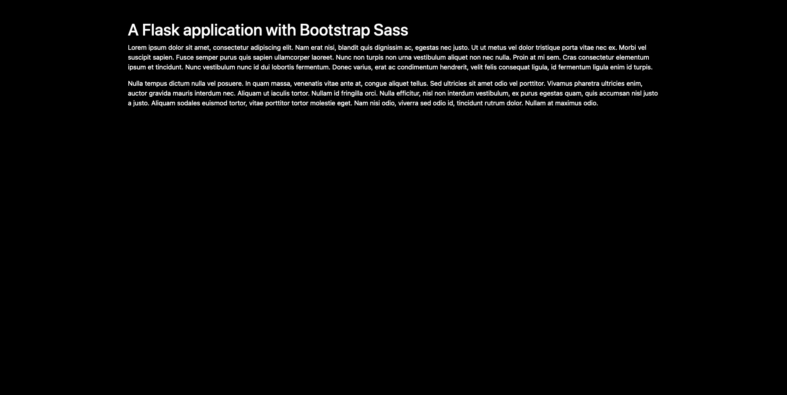

# A minimal Flask application with Bootstrap assets

## 1. Why this repository ?

This repository is a starting point for everyone who wants to build
a web application using Python Flask along with Bootstrap.
Instead of [importing Bootstrap from the CDN](https://getbootstrap.com/docs/5.1/getting-started/introduction/#quick-start), I am [installing it with npm](https://getbootstrap.com/docs/5.1/getting-started/download/#npm) and use [Sass to customize it](https://getbootstrap.com/docs/5.1/customize/sass/).

I wrote a more detailled tutorial about this project on my [personal blog](https://edaoud.com/blog/2022/02/07/flask-bootstrap-assets/).

## 2. Install

First, clone this repository.
``` text
git clone https://github.com/ericdaat/flask-bootstrap-sass.git
```

Then launch the following commands:

``` bash
# Setup virtual environment
virtualenv venv -p python3;
source venv/bin/activate;

# Install python dependencies
pip install -r requirements.txt;

# Install npm modules
cd application/static/assets;
npm install;
cd -;

# Run the application
export FLASK_APP="application.app";
export FLASK_DEBUG="True"
flask run;  # localhost:5000
```

The application should be running locally on
[localhost:5000](http://localhost:5000) and will look like this:



## 3. What's going on ?

In this repository you will find a minimal web application, that displays
some basic text. If you're not familiar with Flask,
I recommend you [start with this tutorial](https://flask.palletsprojects.com/en/2.0.x/tutorial/).

The Flask application module is located at
[application/app.py](./application/app.py). The application uses [static](./application/static/) and [templates](./application/templates/) folders to
render content.

I am using the [Flask-Assets library](https://flask-assets.readthedocs.io/en/latest/) to load the Sass files and generate a CSS file. The following code will read the [main.scss](./applicaton/static/assets/main.scss) file and generate a css file based on it, using the [libsass](https://webassets.readthedocs.io/en/latest/builtin_filters.html#libsass) filter. The generated
CSS file will be saved as `css/scss-generated.css`.

``` python
assets = Environment(app)
assets.url = app.static_url_path

scss = Bundle(
    "assets/main.scss",
    filters="libsass",
    output="css/scss-generated.css"
)
assets.register("scss_all", scss)
```

The [main.scss](./applicaton/static/assets/main.scss) is very basic. We
simply change two default variables, and load the full bootstrap afterwards.

``` javascript
// customize bootstrap default variables
$body-bg: black;		// body background is black
$body-color: white;		// body text is white

// import all of bootstrap now
@import "node_modules/bootstrap/scss/bootstrap";
```

When Flask launches, it processes the [main.scss](./applicaton/static/assets/main.scss), and generate the CSS file. This file can now be used in the Jinja
templates with the following code:

``` html

    <link rel=stylesheet type=text/css href="{{ ASSET_URL }}">

```

The variable `ASSET_URL` points to the generated CSS file path. This file
does not need to be tracked in the repository because the app knows how to
generate it from the [main.scss](./applicaton/static/assets/main.scss) file.
